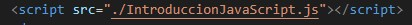
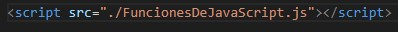

# JAVASCRIPT
----------------------------------------------------

En este repositorio contendra programas con codigo en JavaScript.

**Los siguientes programas de JavaScript:**

* Introduccion a JavaScript.

* Funciones y Excepciones de JavaScript.

Para que estos programas funcionen, se necesita añadir los porgramas de HTML.

* Introduccion de HTML.

* Funciones de HTML.

----------------------------------------

#### Introduccion de HTML

En el siguiente programa ***"IntroHTML*** usamos el siguiente codigo para poder enlazar el programa de **HTML** al programa que tenemos de **JavaScript** que en este caso sera ***"IntroduccionJavaScript"*** .

----------------------------------------------------------------------------------------------------------------------------

#### Funciones de HTML

En el siguiente programa ***"FuncionesHTML*** usamos el siguiente codigo para poder enlazar el programa de **HTML** al programa que tenemos de **JavaScript** que en este caso sera ***"FuncionesDeJavaScript"*** .

---------------------------------------------------------------------------------
